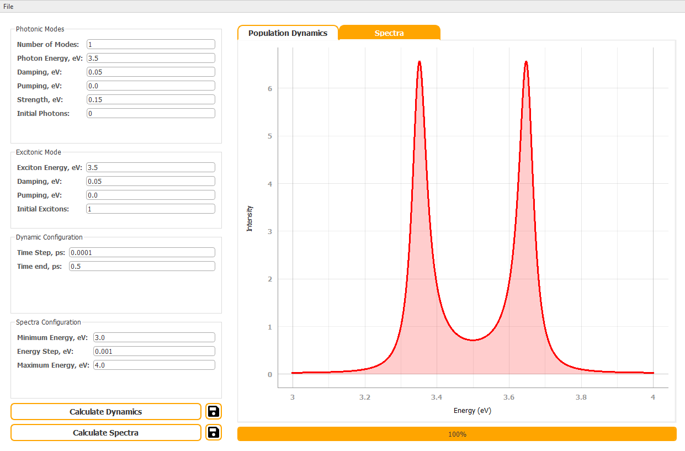
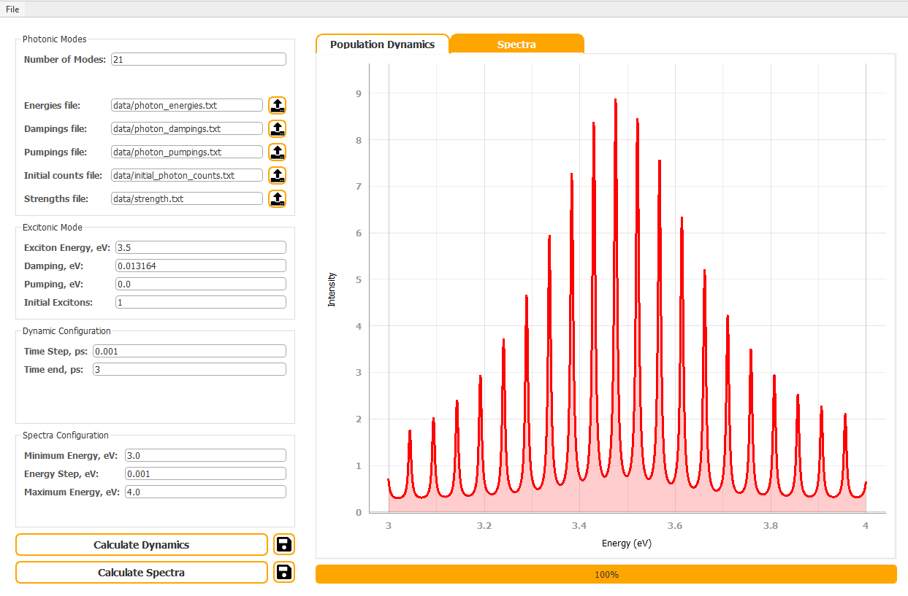

# Emission Spectra Simulator

This program, developed in 2021, performs a quantum analysis of luminescence of an exciton in a meso-cavity. The analysis considers the interaction of several cavity modes with an exciton using a quantum-mechanical approach. The detailed method is described in the paper:
> Belonovski, A. V., Morozov, K. M., Girshova, E. I., Pozina, G., & Kaliteevski, M. A. (2021). Quantum analysis of luminescence of an exciton in a meso-cavity. Optics Express, 29(13), 20724-20734. https://doi.org/10.1364/OE.420277

## Program Description

The program simulates the interaction of cavity modes with an exciton in a meso-cavity. It calculates the dynamics of exciton and photon populations and generates luminescence spectra.

## GUI Features

- **Photonic Modes Configuration**: Allows the user to configure the number of photonic modes and their properties, including energy, damping, pumping, and strength. It also supports loading these parameters from files.
    
- **Excitonic Mode Configuration**: Enables the configuration of excitonic properties such as energy, damping, pumping, and initial excitons.
    
- **Dynamic Configuration**: Sets the parameters for dynamic simulations, including time step and end time.
    
- **Spectra Configuration**: Defines the energy range and step size for spectra calculations.
    
- **Calculate Dynamics**: Computes the time evolution of the exciton and photon populations.
    
- **Calculate Spectra**: Generates the luminescence spectra based on the computed dynamics.
    
- **Save Dynamics**: Allows saving the dynamics results to a file.
    
- **Save Spectra**: Allows saving the spectra results to a file.

## How to Use

### Setup Configuration

- Specify the number of photonic modes. For a single mode, provide the energy, damping, pumping, and strength directly. For multiple modes, load the parameters from files.
- Configure the excitonic mode by specifying its energy, damping, pumping, and initial excitons.
- Set the dynamic configuration parameters, including the time step and end time.
- Define the spectra configuration by setting the minimum and maximum energy values and the energy step.
- Configuration settings can be saved and loaded for convenience. Use the menu options to save your current settings to a file or load settings from an existing file.

### Run Calculations

- Click on the `Calculate Dynamics` button to compute the time evolution of the system.
- Once the dynamics calculation is complete, the `Calculate Spectra` button will be enabled. Click on it to generate the luminescence spectra.

### Save Results

- Use the `Save Dynamics` button to save the dynamics results to a file.
- Use the `Save Spectra` button to save the spectra results to a file.

## Requirements

Ensure you have the following Python packages installed:
- `numpy`
- `pyqtgraph`
- `PyQt5`
- `yaml`
- `scipy`
- `matplotlib`

You can install the necessary packages using the following command:
```bash
pip install -r requirements.txt
```

## Run the program:
```bash
python spectra_simulator.py
```

## Screenshots

Below is a screenshot of the application:


